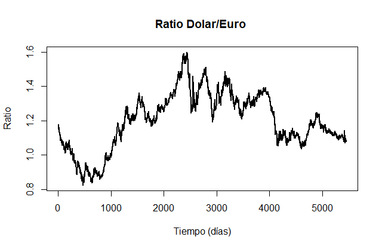
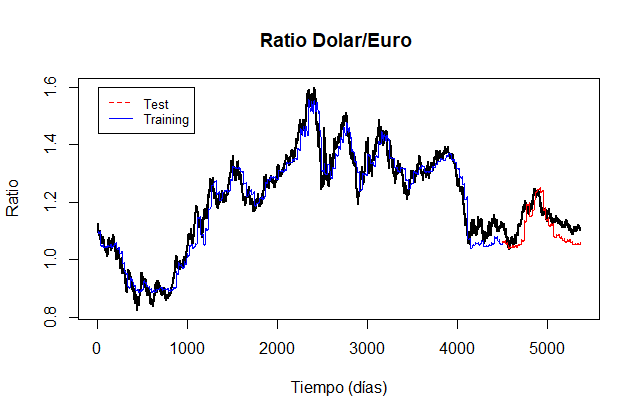
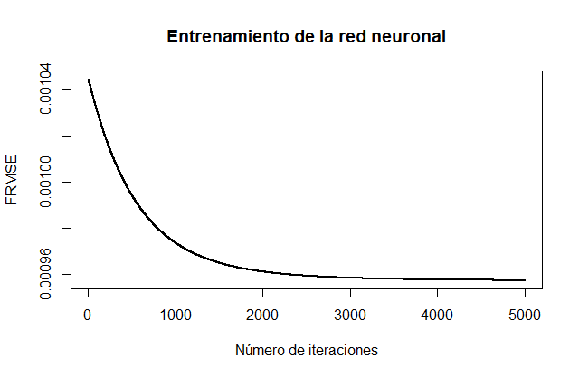
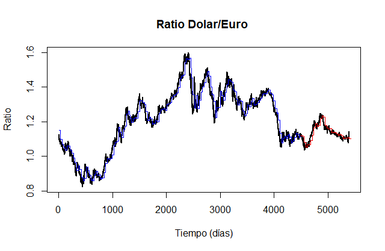
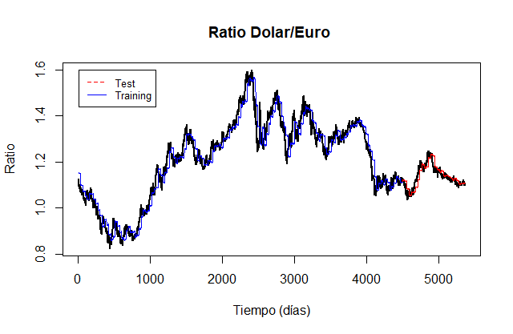
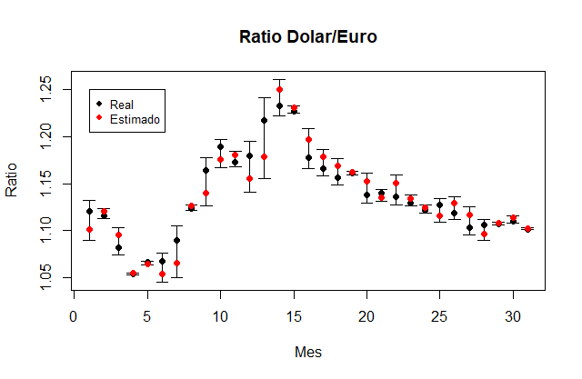
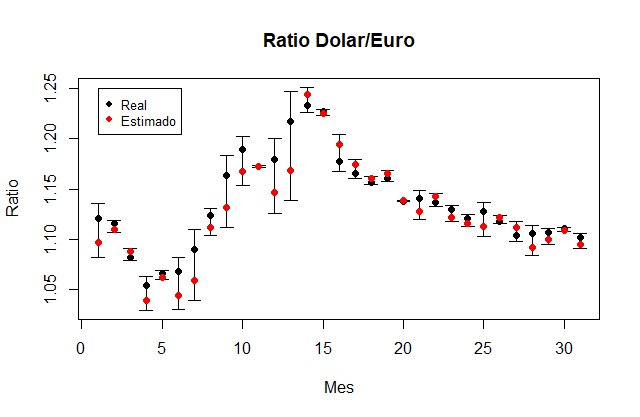

In this chapter we will focus on applying the different methodologies collected throughout my [thesis](http://eio.usc.es/pub/mte/descargas/ProyectosFinMaster/Proyecto_1794.pdf) to a case with real data. Specifically, we will use parametric and non-parametric techniques and autoregressive models in Hilbert spaces of order 1. As a set of data to be analyzed, we will use the exchange price between the dollar and the euro. Our objective is to compare the results of the different methodologies, in order to determine which is the most suitable for this particular case.

Therefore, a question arises, such as determining which model is the most appropriate. To solve this problem we will use different error measures.

##Error measurements.

This section will give a brief description of the different precision measures, which can be calculated for the residuals of a prediction model in the framework of the functional data time series. In general, there is no standard criterion for the measurement of errors and it generally depends on the type of data and the application. In this work you will use three of the most common measures in this type of analysis:This section will give a brief description of the different precision measures, which can be calculated for the residuals of a prediction model in the framework of the functional data time series. In general, there is no standard criterion for the measurement of errors and it generally depends on the type of data and the application. In this work you will use three of the most common measures in this type of analysis:

* The functional mean absolute error (FMAE) defined as

  $$FMAE=\frac{1}{N}\sum_{n=1}^{T}\Vert X_{n}-\widehat{X}_{n} \Vert_{L^1}=\frac{1}{N}\sum_{t=1}^{T}\int \vert  X_{n}(t)-\widehat{X}_{n}(t) \vert dt$$

* The functional mean square error (FMSE) defined as

  $$FMSE= \frac{1}{N}\sum_{n=1}^{T}\Vert X_{n}-\widehat{X}_{n} \Vert_{L^2}^2=\frac{1}{N}\sum_{t=1}^{T}\int \left(   X_{n}(t)-\widehat{X}_{n}(t) \right) ^2 dt$$
  
* If we apply the root to FMSE we have FRMSE

$$FRMSE= \sqrt{\frac{1}{N}\sum_{n=1}^{T}\Vert X_{n}-\widehat{X}_{n} \Vert_{L^2}}=\sqrt{\frac{1}{N}\sum_{t=1}^{T}\int \left(   X_{n}(t)-\widehat{X}_{n}(t) \right) ^2 dt}$$

##Application of the models with functional response.

Our data set consists of the price of the exchange between the dollar and the euro since the formation of the latter.

The objective of the analysis is to study the behavior of the time series using the tools studied in the previous chapters. We will treat each functional data as the function that is estimated from the data of 30 days (one month). We will use a large collection of functional data (around the first 150 months) to fit the model, and the following remaining months as a test. Our response in this analysis will be functional and unlike what is usually done in classical time series models, our predictions will only be one step. With one step predictions we mean that to make the prediction of one month we use the real value of the previous month. This means that if we have already made a prediction for the month of February and we want to make one for March, we will use the real value for the month of February and not the prediction. . Imposing this condition comes from the fact that when working with functional response it is not in principle possible to generate a confidence interval for the prediction. This makes long-term predictions meaningless. In the case of classical time series we do not have this problem, since we could always use bootstrap techniques to determine the confidence intervals. It should be noted that this type of time series can be treated from completely different approaches. Among them we can highlight the stochastic differential equations, widely used in financial studies.

###Application of the parametric regression model.

The first model that we will study will be precisely the first detailed in the work, the functional regression model with parametric functional response. We will use the penalized version of the model proposed by Ramsay that was detailed in chapter two. 

The image shows the fit of the parametric regression model. The estimate of the data set used for the adjustment is represented in blue, while the data set used as the test is represented in red. The fit is considerably good, being slightly less sensitive to abrupt trend changes.

###Application of the non-parametric regression model.

Our next study model is the functional regression model with nonparametric functional response. The main advantage of this model over the previous one is that it is more general, since it does not assume any linearity condition. For our study we will be based on Ferraty's ideas, developed in chapter two and three.

As can be seen in the image the non-parametric regression model had a significantly worse result than the parametric one. While it is true that it hits the trend of the series, the result is not as good as one might expect, especially considering that it is a more flexible model. This result may be due to a window selection that is not as exhaustive as necessary. Another possibility is the use of the FMSE error measure to fit the model, it may not be the most suitable for this particular case.

###Application of the functional neural network model.

The other non-parametric methodology proposed was the use of a single-layer functional neural network. As with the case of non-parametric regression, not assuming linearity gives us more flexibility in the model. However, neural network models can have serious overfitting problems. As mentioned in chapter three we will use the descent of the gradient to train the model using the data set for a test as validation elements. 

In the image  we can see the training behavior of our network. If we increase the number of iterations, the fit of the model will improve, but as we can see, the improvements are increasingly reduced. In this case, a fixed learning rate has been used, although techniques could be used in which the parameter was modified in order to obtain a faster convergence. 

 

Unlike non-parametric regression, this one does seem to have made a good fit in practically the entire time series. Similar to how the parametric regression model behaved. We see that the blue trace fits very well to the original curve, as does the red trace, which indicates that the model has not had any overfitting problem. One of the most particular issues that the neural network model has is the type of predictions it makes. Because the data can be quite abrupt and the type of one-step prediction we are studying, in many cases models experience a large gap between the end of one prediction and the start of the next. In the case of the neural network model, this behavior is clearer than in any other model.

###Application of the autoregressive model in Hilbert spaces.

The last model that we will apply is the autoregressive in Hilbert spaces that was presented in the fourth chapter. We will focus solely and exclusively on the autoregressive model of order one. Two different types of techniques are mentioned when using an orthonormal basis to calculate an estimator of the operator $ \ rho $, the principal components and the partial least squares basis. For this case we are going to use main components which is the most common. 

As we can see in the image  the result is quite good. If it is true that there seems to be a small lag between the prediction and the original data set, although it is already something that we have seen slightly in the other models, it seems that in this case it is clearer. It should be noted that we only needed a single main component.

###Comparison using error measurements.

IN WORKING...

##Application of the model with scalar response.

So far we have only focused on analyzing the data set of the ratio between the price of the dollar and the euro from a point of view in which our answer is entirely functional. Now we will try to study the same problem using the other approach described in the work, when the answer is scalar.

To focus the problem on the scalar response case, we must have a response variable that is a scalar. We will work with a new variable that will not be more than the average of the ratio. The objective is therefore to determine the average value for the following month based on how it has evolved over the previous month. Since the model that gave the best result in the case with functional response was the parametric one, we will only focus on this one. We will use a penalized model identical to the previous case, but for a model with a scalar response and another model generated by partial least squares, both described in topic two.
We will start by studying the penalized parametric model.

###Penalized parametric model.

As we did in the case with functional response, we will divide the time series. We will do it in an identical way to the previous sections, with the difference that in this case we will only focus on the prediction of the data not used in the training set.

If we look at the image  we have the real values represented in black while our predictions are in red. The results at first glance seem considerably good. The image shows the graph of the model residuals. The behavior is at least a little suspicious. To determine the independence of the residuals, a Ljung-Box test was performed for the first fifteen lags. The image shows the p-values for the different tests, where the red line represents the p-value = 0.05.

We could perform a normality test with the hope of being able to determine a prediction interval, however the residuals are not homoscedastic, so we cannot use this way. What we can do is wild boostrap to determine the prediction intervals. The prediction intervals have been chosen to reach a 99 $ \% $ confidence.

###Partial least squares model.

We will do an analysis identical to that of the penalized parametric model with the only difference that in this case we will not use any penalties. What we do have to take into account about this model is that it focuses on determining an orthonormal basis focused on achieving the best possible prediction. Once we have determined the base, using a greater number of elements does not imply a better result. Therefore, something similar to the ARH (1) models happens to us when we use principal components. We will use the root mean square error to determine the most suitable number of elements in the base.

We have used the first three components pls for the model. The results are quite similar to what we obtained in the penalized parametric model. As we did in the previous case, we are going to perform wild bootstrap on the residuals to determine a confidence interval on the predictions.

###Comparison using error measurements.

IN WORKING