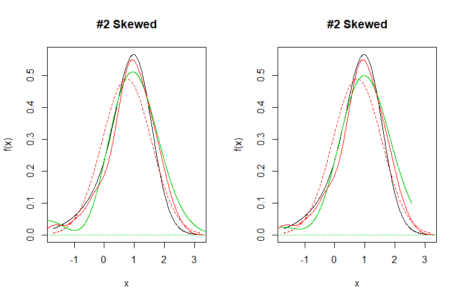
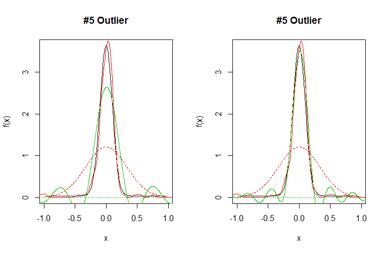
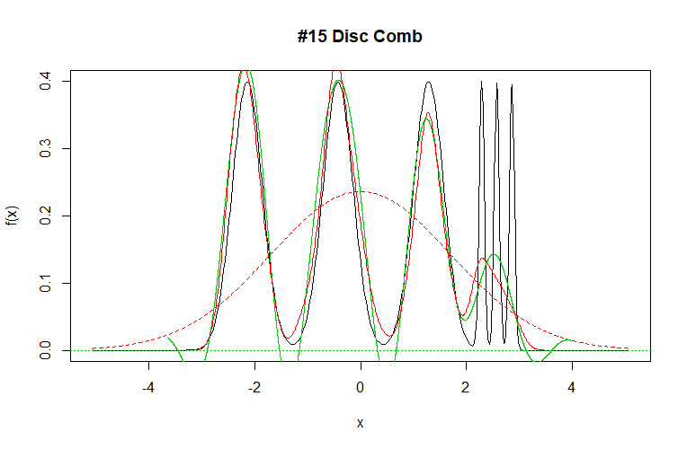

#Estimation of the density function by orthonormal series

The code and aplication to the Marron and Wand models could be found in [code](https://github.com/uo225824/DFE) and [images](https://github.com/uo225824/DFE/blob/main/12345final.pdf).

##Introduction

The idea of the following work will be to propose an alternative formulation to the estimation by core type of the density function. For this we introduce the developments by orthonormal series.

Throughout the work we study the search for the best estimator of the density function through orthonormal developments. For this, we will use, mainly, two concepts: the likelihood function and the penalty criteria. The objective of the first will be to obtain the best possible estimator, while the penalty criteria will serve to take into account questions of form such as kurtosis or the number of modes of the curve.

###Orthonormal series

Let $f(x)$ be a function defined in Hilbert space $\Omega$ with inner product defined as:

$$
\langle f \vert g \rangle = \int _ {\Omega} f (x) g (x) dx
$$

and norm:

$$
\Vert x \Vert = \sqrt {\langle x \vert x \rangle}
$$
The function $f(x)$ is said to be square integrable in the space $\Omega$ if it meets the condition:

$$
\langle f \vert f \rangle = \int _ {\Omega} f (x) ^ * f (x) dx = \int _ {\Omega} \vert f (x) \vert ^ 2 dx <\infty
$$

From now on we will work with integrable square functions.

Let $\lbrace \varphi_{i}(x) \rbrace$ be an orthonormal basis \footnote {Orthonormal vectors are those vectors that satisfy the condition $\langle \varphi_ {i} \vert \varphi_ {j} \rangle = \delta_ {ij}$, where $\delta_ {ij}$ is the Kronecker delta.} We can approximate a function f (x) by a serial sum in the following way:

$$
f (x) = \sum_ {i = 0} ^ {\infty} a_ {i} \varphi_ {i} (x)
$$
Where the coefficients fulfill:

$$
a_ {i} = \langle f \vert \varphi_ {i} \rangle
$$

##Estimation of the density function

We can try to determine an approximation to the density function using the series expansion of the previous section.
We do not know the function $f(x)$ with which we cannot determine the coefficients $a_{i}$, however, if we remember the definition of $a_{i}$:

$$
a_ {i} = \int_ {\Omega} f (x) \varphi_ {i} (x) dx = E [\varphi_ {i}]
$$

So our problem is summarized in the determination of an estimator of the expectation of $\varphi_{i}(x)$.
$$
\widehat {a}_{i} = \frac {1} {n} \sum_{j = 1} ^ {n} \varphi_ {i} (X_ {j})
$$

and our approximation of the density function is:

$$ \label {equation}
\widehat {f} (x) = \sum_ {i = 0} ^ {\infty} \widehat {a} _ {i} \varphi_ {i} (x)
$$

A slightly different version to the one proposed would be the following modification of the relation \ref {equation}:
$$ \label {equation1}
\widehat {f} (x) = \sum_ {i = 0} ^ {\infty} b_ {i} \widehat {a} _ {i} \varphi_ {i} (x)
$$

Where the $b_{i}$ are smoothing parameters that we determine by minimizing the mean square error [Simonoff]. In our study we will carry out both approaches and compare results.

We will work with a small modification of the Hermite polynomials:

$$
\varphi_ {m} = \frac {H_ {m} * e ^ {- x ^ 2/2}} {\sqrt {\sqrt {\pi} 2 ^ {m} m!}}
$$

Which are orthonormal and are defined in $(- \infty, \infty)$.

Our goal is to determine a good estimator of the density function. In classical series runs, the higher the order of development, the better the approximation. This is not true in the approximation of the density function, since we have a small number of data instead of functions. Development tends to interpolate rather than approximate when we increase the order. It is for this reason that we cannot let the development reach very large orders. In this study, we will always work with orders in development smaller than the number of data.

The question now is to determine which is the proper order in the development to make the best approximation. For this we will use the likelihood function calculated with the estimator of the density function. We will calculate the likelihood function for all developments from the order $0$ to $N-1$, where $N$ is the number of data, choosing the one that is maximum. However, this method has a couple of drawbacks. The first drawback, as already mentioned, is that higher orders in development tend to interpolate, which will produce higher values of the likelihood function even though these estimates are not the most appropriate for the model. The other drawback is that higher order implies greater ripple in the estimation, and we are interested in making the estimator smooth. The latter occurs despite using the $b_ {i}$ parameters. To solve this problem we will use the same idea on which the information criteria for the regression are based. We will use a modified version of Akaike's corrected criteria:

$$
AICc (k) = - 2ln (\mathcal {L}) + 2k + \frac {2k ^ 2 + 2k} {N-k-1}
$$

Where $\mathcal {L}$ is the likelihood function and $k$ the order in the expansion. We will stick with the approximation that gives a lower value to Akaike's criteria.

In the figure \ref {fig: cc} we have the approximation of model 2 by Marron and Wand, where on the left we have the model without parameter $b_{i}$ and on the right taking it into account. The green trace is our estimate, the red trace is the core estimate, and the black trace is the actual value. As we can see there is not a big difference between using the smoothing parameters or not, that is why from now on we will work with the model without $b_{i}$, for simplicity and computation time.

In certain situations Akaike's criteria may penalize more than desired. This fact is appreciated when we have to make approximations of figures with a lot of kurtosis or with various fashions. The penalty is not excessive, but it is enough to consider making a small modification to the criteria. In this way, the idea of using a new criterion that took into account properties of form arose.

When we have a density function with a lot of kurtosis, high values in the development generate very good approximations in the zone of the maximum, however, a lot of ripple in the zone of the tails. Akaike's criterion tends to over-smooth the estimate and high orders produce too much curl, for this reason we make the following modification to $AICc$:

$$
AICc (k) = - 2ln (\mathcal {L}) + 2k + \frac {2k ^ 2 + 2k} {N-k-1} -k * c
$$

Where c is the kurtosis estimated with the kurtosis command from the R package e1071.

In the figure \ref {fig: cc1} the determined models are compared without the correction (left model) and with the correction (right model).

For distributions that have more than one mode the problem is equivalent. The AICc criterion tends to prioritize models with a single mode and very low kurtosis. We use a criterion equivalent to that in the case of high kurtosis:

$$
AICc (k) = - 2ln (\mathcal {L}) + 2k + \frac {2k ^ 2 + 2k} {N-k-1} -k * m
$$

Where m is the number of modes estimated with the command nmodes of R's multimode package.

##Conclusions

The conclusions that we obtain from the estimation by orthonoral series on the Marron and Wand models is that good results are obtained in the search for the density function. The proposed estimate manages to correctly fit the data, which present various situations difficult to model.

In fact, in these types of situations, the most abrupt, the estimation by orthonormal series seems to adjust better to the real curve than the core-type estimation, without this event being something that we can establish in a generic way.

On the other hand, this type of development requires a great deal of computing time to obtain the various degrees of the hermite polynomials. Therefore, when obtaining the estimate, the difference in computation time between the two compared methods, core type or orthonormal series, is very much in favor of the first.

Add that, this type of estimation tends to generate excess ripple in the tails, which is not of interest when studying estimates of the density function. This situation could be improved if the idea of smoothing parameters, whose study has been omitted in this work, were developed.

##Bibliography 

\bibitem[Simonoff, 1996]{Simonoff:1996}
 Simonoff, J.S. (1996). \newblock{\em Smoothing Methods in Statistics}. \newblock Springer.
 
 \bibitem[e1071, 2018]{e1071:2018}
 Meyer, D., Dimitriadou, E., Hornik, K., Weingessel, A., Leisch, F., Chang, C., Lin, C.  \newblock{\em Misc Functions of the Department of Statistics, Probability Theory Group}. \newblock {TU Wien.}

\bibitem[Multimode, 2018]{multimode:2018}
Ameijeiras Alonso, J., Crujeiras, R.M. and Rodríguez Casal, A. \newblock Multimode: An R Package for Mode Assessment. \newblock {\em arXiv preprint: 1803.00472.}

